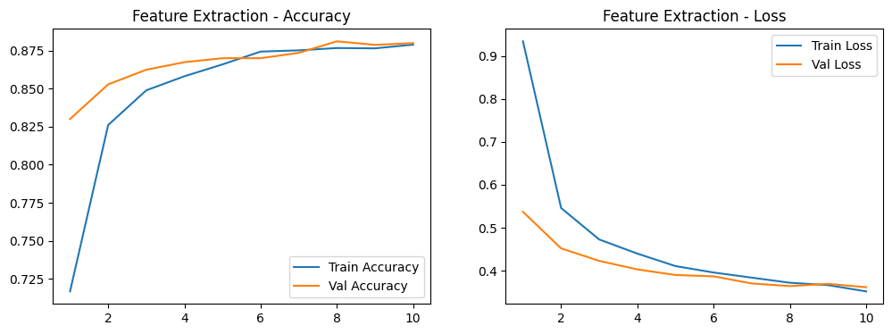
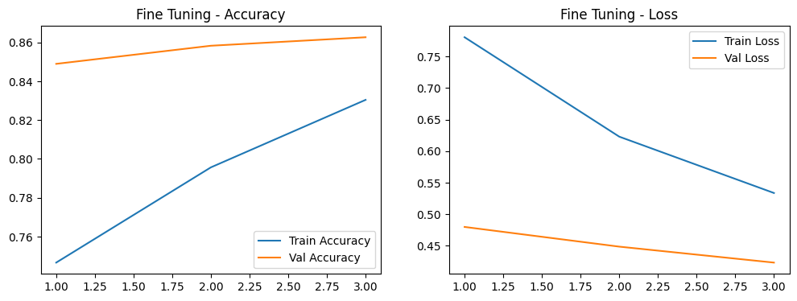

## 🧠 Task Overview

You will apply **Transfer Learning** using **EfficientNet** models with two approaches:  
1. **Feature Extraction**  
2. **Fine-tuning**

⚠️ This task **must be completed in Google Colab or a cloud-based environment**. Training deep models like EfficientNet on local machines without GPU/TPU is highly inefficient and may lead to failed or incomplete experiments.

## 📁 Dataset

Dataset is already downloaded and loaded in the notebook. Preprocess as needed for training.

## 🧪 Experiments

### 1️⃣ Feature Extraction  
- freeze all base layers  
- train only the classification head  

### 2️⃣ Fine-tuning  
- unfreeze last layers  
- retrain full or partial base  

## Experiment Summary

In this project, I applied **Transfer Learning** using **EfficientNetB0** to classify images from the Food11 dataset using two main approaches:

### Feature Extraction
I froze all EfficientNet base layers and trained only the classification head. This resulted in fast training, stable convergence, and the best performance.

**Test Accuracy:** 90.23%

### Fine Tuning
I unfroze the last layers of EfficientNet and retrained them using a smaller learning rate to allow the model to adapt deeper features.

**Test Accuracy:** 86.70%

I also experimented with gradual unfreezing to improve training stability.

---

## Plots for Metrics

I analyzed the training behavior using:

- Training vs Validation Accuracy
- Training vs Validation Loss
- Model comparison plots

Feature extraction showed smoother curves and more stable validation performance compared to fine tuning.

---

## Observations

### Feature Extraction vs Fine Tuning

Feature extraction performed better in this task because pretrained ImageNet features were already strong and required less retraining.

Fine tuning allowed more flexibility but increased the risk of overfitting 

---

### Generalization

Feature extraction showed better generalization because the training and validation curves remained close and stable.

Fine tuning showed slightly more fluctuation in validation performance.

---

### Convergence

Feature extraction converged faster and showed stable learning behavior.

Fine tuning required more careful tuning and converged more slowly due to the lower learning rate.

---

### Overfitting

Feature extraction showed low overfitting risk.

Fine tuning showed mild overfitting signs due to the increased number of trainable parameters.

---

## Experiment Tracking

I used **MLflow** to track:

- Model parameters
- Training metrics
- Model versions
- Training artifacts

This helped me compare experiments and improve reproducibility.

---

## DagsHub Integration

I used **DagsHub** to:

- Manage the dataset in cloud storage
- Track MLflow experiment runs
- Store model experiments

This helped improve experiment organization and reproducibility.

---

## Conclusion

Feature extraction achieved the best performance with **90.23% accuracy** and better generalization compared to fine tuning.

Transfer learning significantly reduced training time and allowed me to achieve strong results without training a model from scratch.

EfficientNet proved to be very effective for this image classification task.